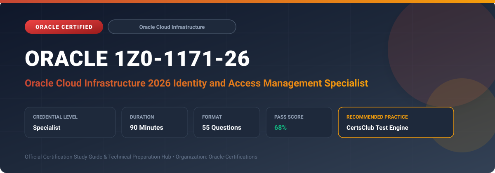

  

# Oracle 1Z0-1171-26: Oracle Cloud Infrastructure 2026 Identity and Access Management Specialist

---

## 1. Exam Overview & Candidate Profile

The **Oracle 1Z0-1171-26: Oracle Cloud Infrastructure 2026 Identity and Access Management Specialist** credential certifies professionals who demonstrate technical mastery, architectural competence, and hands-on operational capability in this certification domain.

Candidates validate comprehensive knowledge and expertise required to design, configure, manage, and optimize mission-critical Oracle environments across cloud, on-premises, and hybrid architectures.

### Target Audience & Prerequisites
- **Target Roles**: Implementation Specialists, Cloud Architects, Technical Leads, Enterprise Consultants, and Systems Engineers.
- **Recommended Experience**: 1–2 years of practical, hands-on experience designing, implementing, and maintaining corresponding Oracle solutions.
- **Credential Earned**: Specialist Certification.

---

## 2. Key Exam Specifications

| Specification | Details |
| :--- | :--- |
| **Exam Code** | **Oracle 1Z0-1171-26** |
| **Official Title** | Oracle Cloud Infrastructure 2026 Identity and Access Management Specialist |
| **Certification Track** | Oracle Cloud Infrastructure |
| **Exam Duration** | 90 Minutes |
| **Number of Questions** | 55 Questions |
| **Passing Score** | 68% |
| **Question Format** | Multiple Choice (Single/Multiple Answer), Scenario-Based Questions |
| **Delivery Provider** | Oracle University / Pearson VUE (Online Proctored or Test Center) |
| **Recommended Practice Engine** | [CertsClub Oracle Practice Tests](https://www.certsclub.com/oracle/1z0-1171-26-dumps.html) |

---

## 3. Official Blueprint & Exam Domain Breakdown

The examination assesses candidate competencies across core functional domains weighted as follows:

| Domain Area | Weighting |
| :--- | :--- |
| **OCI IAM Identity Domains Architecture & Migration** | `25%` |
| **Authentication, MFA, SSO & SAML/OIDC Federation** | `25%` |
| **Dynamic Groups, Workload Identities & Instance Principals** | `20%` |
| **Fine-Grained IAM Policy Syntax & Tag-Based Access Control** | `15%` |
| **Identity Lifecycle, Access Reviews, Auditing & Governance** | `15%` |

---

## 4. Deep Dive into Complex & Challenging Technical Topics

To secure a passing score on the 1Z0-1171-26 exam, candidates must master the following advanced concepts:

- Administering OCI IAM Identity Domains (Free, Premium, External User types) and multi-domain tenancy hierarchies.
- Federating enterprise identity providers (Microsoft Entra ID, Okta, Ping Identity) using SAML 2.0 and OpenID Connect (OIDC).
- Implementing passwordless authentication, adaptive MFA, risk-based access policies, and self-service credential resets.
- Writing complex conditional IAM policies using request/target attributes, compartment scopes, and tag-based access control (TBAC).
- Configuring Dynamic Groups with matching rules to grant compute instances and OKE workloads authorization via Instance/Workload Principals.

---

## 5. Scenario-Based Demo & Practice Questions

### Question 1
Which OCI IAM feature allows applications running on compute instances to authenticate against OCI API services without hardcoding API keys or credentials?

A) Instance Principals with Dynamic Groups
B) Root account auth tokens
C) Hardcoded SSH private keys
D) Public API Gateway bypass

- **Correct Answer**: `A) Instance Principals with Dynamic Groups`  
- **Technical Explanation**: By defining a Dynamic Group matching compute instances and granting IAM policy permissions to that group, applications use Instance Principals to sign API calls securely.

---

### Question 2
What OCI IAM mechanism enforces that only members of the 'FinanceSecOps' group can manage resources labeled with the cost-center tag 'CostCenter.ID = 4402'?

A) Tag-Based Access Control (TBAC) policy conditions
B) VCN Security List rules
C) Compute instance shape limits
D) Object Storage life cycle rule

- **Correct Answer**: `A) Tag-Based Access Control (TBAC) policy conditions`  
- **Technical Explanation**: Tag-Based Access Control (TBAC) allows policy statements to evaluate defined tag keys and values in the `where target.tag...` clause, dynamically restricting authorization.

---

## 6. Recommended Preparation Strategy & Practice Testing Engine

Achieving certification in **Oracle 1Z0-1171-26** requires balanced theoretical study and scenario-based simulation practice:

1. **Review Oracle Documentation**: Master architecture guides, implementation workbooks, and administration manuals on the Oracle Help Center.
2. **Hands-on Lab Practice**: Execute real-world configuration, policy setup, and troubleshooting tasks in your cloud tenancy or test instance.
3. **Simulated Exam Drills**: Practice answering timed, scenario-based multiple-choice questions to familiarize yourself with the question formats, traps, and timing constraints.

### Practice With CertsClub
For realistic practice questions, updated dumps, and mock testing environments:
- **Resource**: [CertsClub Oracle Practice Test Engine](https://www.certsclub.com/oracle/1z0-1171-26-dumps.html)
- **Special Discount**: Use coupon code **`club20`** during checkout for an instant **20% discount** on all practice exam bundles and testing engines.

---

## 7. Official Documentation & References

- [Oracle University Certification Registry](https://education.oracle.com/)
- [Oracle Help Center Documentation Portal](https://docs.oracle.com/)
- [Oracle Cloud Infrastructure & Applications Guides](https://docs.oracle.com/en/cloud/)
- [CertsClub Oracle Certification Exam Practice](https://www.certsclub.com/oracle/1z0-1171-26-dumps.html)

---

## 8. SEO & Discovery Keywords

`oracle 1z0-1171-26, oracle 1z0-1171-26 exam, oracle 1z0-1171-26 dumps, 1Z0-1171-26 practice questions, 1Z0-1171-26 study guide, oci 2026 identity and access management specialist, certsclub 1z0-1171-26`